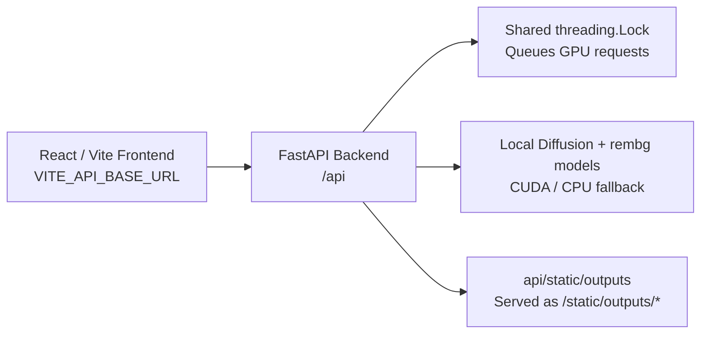

# AI Photo Editor Dashboard

Photo Editor Dashboard is a local-first AI image workspace for generation and editing. The current milestone covers these capabilities:

- Text-to-image generation
- Inpainting / object replacement
- Outpainting / canvas expansion
- Background removal
- Background replacement
- Face enhancement
- Upscaling
- Magic Eraser
- Style transfer
- Image variations

The frontend is a Vite + React + TypeScript dashboard. The backend is a FastAPI service that calls the preserved inference functions in `api/app/ai/ai_core.py`.

## Architecture



The frontend sends multipart form uploads to FastAPI, FastAPI serializes model access with a single lock, and outputs are saved as PNG files in `api/static/outputs/` and returned as URLs.

## Prerequisites

- Node.js 20+ and npm
- Python 3.11
- For practical performance: an NVIDIA GPU with CUDA support, current NVIDIA drivers, and roughly 8 GB VRAM
- Internet access for first-run model downloads

The backend falls back to CPU when CUDA is unavailable, but diffusion operations will be very slow.

## Voice Editing

The Editor supports optional, browser-native voice controls. No audio is uploaded to this application or sent to the FastAPI backend.

- **Dictate** appears beside the edit prompt for Inpainting and Outpainting; it replaces the prompt with the final transcript.
- **Voice** accepts commands including “remove background”, “enhance face”, “upscale”, “generate variations”, “apply watercolor”, “pencil sketch”, “cartoon”, and “anime”.
- Commands that need more input select the appropriate tool but do not bypass the existing requirements: paint a mask for inpainting/object removal/Magic Eraser, choose a background for replacement, or enter an outpaint prompt.
- Use “apply” to run the currently selected tool.

Voice input requires a browser that exposes the Web Speech Recognition API, typically a Chromium-based browser, plus microphone permission. In unsupported browsers or after a denied permission request, all typed editor controls remain available.

## Quick Start

Open two terminals at the repository root.

### 1. Start the backend

In the first PowerShell terminal:

```powershell
cd api
py -3.11 -m venv venv
venv\Scripts\activate
python -m pip install --upgrade pip

# Install the exact CUDA 12.1 PyTorch stack first.
pip install torch==2.5.1+cu121 torchvision==0.20.1+cu121 torchaudio==2.5.1+cu121 --index-url https://download.pytorch.org/whl/cu121

# Install FastAPI, Diffusers, rembg, GFPGAN, Real-ESRGAN, and test tools.
pip install -r requirements.txt
Copy-Item .env.example .env
uvicorn app.main:app --reload --env-file .env
```

Confirm the API starts with:

```powershell
Invoke-WebRequest -UseBasicParsing http://127.0.0.1:8000/api/health |
  Select-Object -ExpandProperty Content
```

Expected:

```json
{ "status": "ok", "device": "cuda" }
```

`device: "cpu"` means the API started but GPU acceleration is not available.

### 2. Start the frontend

In a second PowerShell terminal:

```powershell
npm install
Copy-Item .env.example .env
npm run dev
```

Open the URL Vite prints, normally http://localhost:5173.

The backend must be started from the `api` directory so `uvicorn app.main:app --reload --env-file .env` can resolve the package layout and load the local CORS origin.

## Configuration

| File | Variable | Default | Purpose |
| --- | --- | --- | --- |
| `.env` | `VITE_API_BASE_URL` | `http://localhost:8000` | Backend URL used by the browser |
| `api/.env` | `FRONTEND_ORIGIN` | `http://localhost:5173` | Allowed frontend origin for CORS |

## First-Run Model Downloads

Model-backed features load lazily. The first request for a capability can take several minutes while weights download and initialize.

| Capability | Model/cache location |
| --- | --- |
| Generation, style transfer, variations | `runwayml/stable-diffusion-v1-5` in the Hugging Face cache |
| Inpainting, outpainting, Magic Eraser | `stable-diffusion-v1-5/stable-diffusion-inpainting` in the Hugging Face cache |
| Background removal/replacement | rembg/U2Net cache |
| Face enhancement | `api/app/ai/weights/GFPGANv1.4.pth` |
| Upscaling | `api/app/ai/weights/realesr-general-x4v3.pth` |

Model weights and generated output files are ignored by Git. Keep the backend process running to reuse loaded models.

## Using the Editor

1. Generate an image in **Create**, then open **Editor**.
2. Select an AI tool from the left panel.
3. For Inpainting, Object Removal, and Magic Eraser, paint the affected canvas area. White mask strokes are regenerated; black areas are kept.
4. For Background Replacement, choose a solid color or upload a background image.
5. For Style Transfer, choose a preset. Image Variations returns selectable thumbnails.
6. Select **Apply Tool**. The result replaces the active canvas image and is saved to the gallery.

## Hardware Requirements

Tested on:

- RTX 4060 laptop GPU with 8GB VRAM
- 24GB system RAM

The code uses fp16 CUDA inference when available and falls back to CPU only if CUDA is unavailable, which is far too slow for a normal editing workflow.

## API Reference

Base URL: `http://localhost:8000`

### GET `/api/health`

Returns the backend status and active compute device.

Response:

```json
{ "status": "ok", "device": "cuda" }
```

### POST `/api/generate`

Multipart fields:

- `prompt` required
- `negative_prompt` optional
- `width` optional
- `height` optional
- `steps` optional
- `seed` optional

Response:

```json
{ "url": "http://localhost:8000/static/outputs/<uuid>.png", "filename": "<uuid>.png" }
```

Example:

```bash
curl -X POST http://localhost:8000/api/generate \
	-F "prompt=a cozy mountain cabin at sunset" \
	-F "width=768" \
	-F "height=768" \
	-F "steps=25"
```

### POST `/api/inpaint`

Multipart fields:

- `image` required file upload
- `mask` required file upload
- `prompt` required
- `negative_prompt` optional
- `steps` optional
- `guidance_scale` optional

Example:

```bash
curl -X POST http://localhost:8000/api/inpaint \
	-F "image=@input.png" \
	-F "mask=@mask.png" \
	-F "prompt=a red sports car" \
	-F "steps=30" \
	-F "guidance_scale=12"
```

### POST `/api/outpaint`

Multipart fields:

- `image` required file upload
- `expand_px` optional
- `prompt` optional
- `negative_prompt` optional
- `steps` optional

Example:

```bash
curl -X POST http://localhost:8000/api/outpaint \
	-F "image=@input.png" \
	-F "expand_px=128" \
	-F "prompt=seamless continuation of the scene" \
	-F "steps=30"
```

### POST `/api/remove-background`

Multipart fields:

- `image` required file upload

Example:

```bash
curl -X POST http://localhost:8000/api/remove-background \
	-F "image=@input.png"
```

### POST `/api/background-replace`

Multipart fields:

- `image` required file upload
- `mode` required: `color` or `image`
- `background_color` required when `mode=color` (hex value such as `#3498db`)
- `background_image` required file upload when `mode=image`

### POST `/api/face-enhance`

Multipart fields:

- `image` required file upload

Restores faces with GFPGAN and returns the standard `{url, filename}` image response.

### POST `/api/upscale`

Multipart fields:

- `image` required file upload
- `scale` optional, defaults to `4` and accepts `1` through `4`

Uses tiled Real-ESRGAN inference to stay within the 8GB GPU target.

### POST `/api/magic-eraser`

Multipart fields:

- `image` required file upload
- `mask` required file upload; white marks the object to remove

The server supplies its removal prompt, so the client must not send a `prompt` field.

### POST `/api/style-transfer`

Multipart fields:

- `image` required file upload
- `style` required: `oil_painting`, `watercolor`, `pencil_sketch`, `cartoon`, or `anime`
- `strength` optional, defaults to `0.6`

### POST `/api/image-variations`

Multipart fields:

- `image` required file upload
- `count` optional, defaults to `4` and is capped at `4`
- `strength` optional, defaults to `0.6`

Response is a list of saved image records:

```json
[
  { "url": "http://localhost:8000/static/outputs/<uuid>.png", "filename": "<uuid>.png" }
]
```

## Environment Variables

Frontend:

- `VITE_API_BASE_URL` — backend URL used by the React client

Backend:

- `FRONTEND_ORIGIN` — allowed CORS origin for local development

Example files:

- `.env.example`
- `api/.env.example`

## Known Issues / Lessons Learned

- `xformers` can silently upgrade Torch and break CUDA compatibility with `torchvision` and `torchaudio`. This milestone avoids `xformers` and pins the exact working Torch stack instead.
- `transformers` 5.x refuses to `torch.load()` legacy `.bin` weights on Torch versions below 2.6 because of CVE-2025-32434. The backend uses models that ship proper `.safetensors` weights.
- `stabilityai/stable-diffusion-2-inpainting` is a gated Hugging Face repository and returns 401/404 for anonymous downloads. The backend uses the public `stable-diffusion-v1-5/stable-diffusion-inpainting` mirror instead.
- That mirror uses `variant="fp16"` because its safetensors files are named with the `.fp16.safetensors` suffix.
- `basicsr` imports `torchvision.transforms.functional_tensor`, which was removed in torchvision 0.15. `ai_core.py` registers that name as an alias for `torchvision.transforms.functional` before GFPGAN or Real-ESRGAN imports run, preserving compatibility with the pinned `torchvision==0.20.1+cu121`.
- The first request to each model-backed capability can be slow because the model is downloaded and initialized. Keep the backend running to reuse the in-process pipeline cache.
- Inpainting now requires painting the intended region in the Editor canvas. The UI exports a black mask with user-painted white strokes, so it no longer performs an arbitrary centered edit. Fine-grained selection, undo/redo, and feathering are not implemented yet.
- Local browser automation was unavailable in the verification environment due to a restricted browser-runtime filesystem permission. The Vite app itself served successfully on port 5173, and the API client error handling was statically verified; repeat the visual browser smoke test on a normal local browser before a production release.
- Authentication, batch jobs, and object detection/segmentation are planned but out of scope for this milestone.

## Project Notes

- The FastAPI routes save output images to `api/static/outputs/` and return their served URLs.
- Requests are serialized with a module-level lock so only one GPU operation runs at a time.
- Face enhancement and upscaling weights download automatically to `api/app/ai/weights/` on their first use.
- Voice recognition is browser-only; it never changes backend model or upload behavior.

## Verification

Run the frontend checks from the project root:

```powershell
node --experimental-strip-types --test src/lib/voice-commands.test.ts
npm run lint
npm run build
```

Run backend checks from the `api` directory:

```powershell
venv\Scripts\python.exe -m pip check
venv\Scripts\python.exe -m pytest tests -v
```

The GPU verification pass confirmed CUDA availability; every AI editing endpoint wrote a PNG output and returned a loadable URL. Background replacement was checked in color and image modes, Magic Eraser ran without a client prompt, style transfer produced visibly distinct watercolor and pencil-sketch results, and Image Variations returned four saved images.
